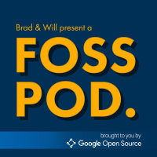

# Welcome to the FOSS Pod Community Wiki!

This is a community wiki for [Brad and Will Present a FOSS Pod](https://fosspod.content.town),
a biweekly podcast about the Free and Open Source Software (FOSS) that’s changing the world, and the developers who are making it happen.

This Wiki is hosted on [Github:
FOSSPod-wiki](https://github.com/TurboSB/FOSSPod-wiki) See [README](README.md)
for detail documentation.

Any suggestions and comments, use the [Issue Tracker](https://github.com/TurboSB/FOSSPod-wiki/issues)

## Episodes
### Season 1
1. [OBS With Jim Bailey](episodes/S1E1-OBS.md)
2. [Getting Started With Network Attached Storage](episodes/S1E2-NAS.md)
3. [The FOSS Pod Manifesto](episodes/S1E3-Manifesto.md)
4. [Open Source 101](episodes/S1E4-OSS101.md)

## Show Sponsors
[Google Open Source](opensource.google)

## Helpful Lists of FOSS packages
[Wikipedia](https://en.wikipedia.org/wiki/List_of_free_and_open-source_software_packages)
